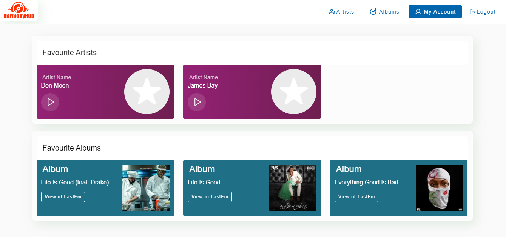
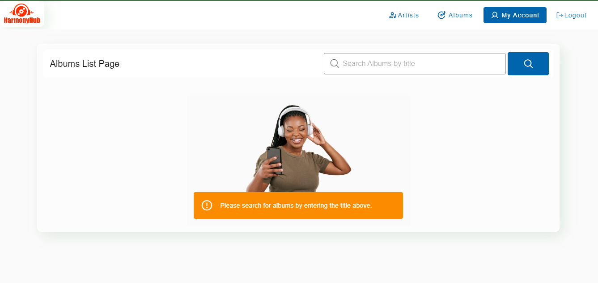
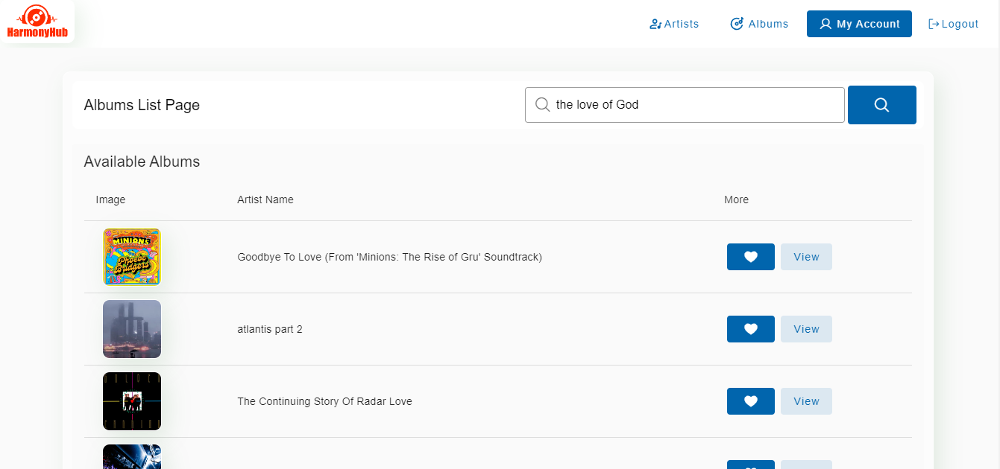
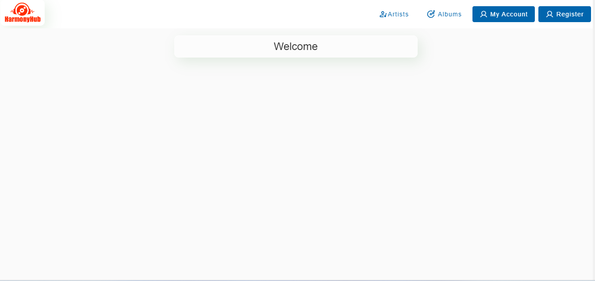
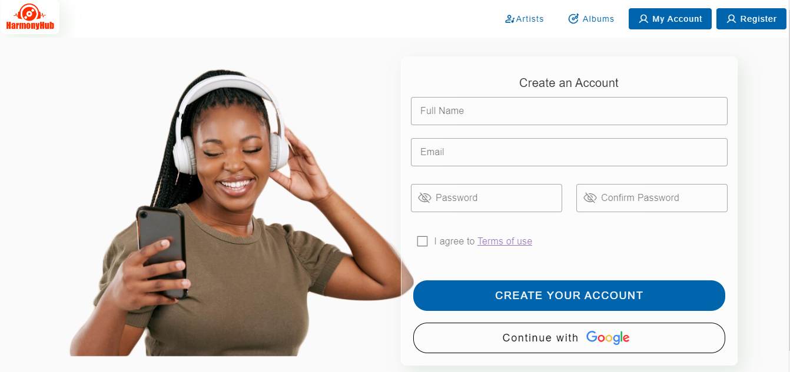

# HarmonyHub

Full-stack Coding Assessment response by Emmanuel Siziba
 
## Technologies Used

- Laravel 10
- Inertia.js
- VueJS 3
- Vuetify + Phosporicons
- Vite

## System Requirements
- PHP version 8.0 and above,
- MySQL version 5 and above
- Composer
- Node
- Yarn


## Installation

Clone repo locally
```bash
 git clone https://github.com/SyzbaLinux/zatecEmmanuelSiziba
```

Install PHP Dependencies

```bash
composer install 
```

If Composer install fails run

```bash
composer update
```

Install NPM Dependencies

```bash
npm install
```

If NPM gives errors use Yarn

```bash
yarn install
```

Build assets for production

```bash
npm run build
```

Setup Configuration

```bash
cp .env.example .env
```

Generate application key

```bash
php artisan key:generate
```

Run Database migrations

```bash
php artisan migrate
```

For demo data
```bash
php artisan migrate --seed
```

# Screenshots

### Longed In User


### Albums List Page


### Search Results


### Welcome, Page


### Register Page

